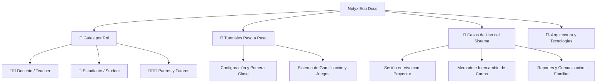

# 📚 Notyx Edu — Centro de Documentación y Guías

Bienvenido al centro oficial de documentación, tutoriales y casos de uso de **Notyx Edu**, la plataforma académica gamificada que transforma el seguimiento de estudiantes en una experiencia ágil, motivadora e interactiva.

---

## 🎯 Mapa de Documentación

---

## 🧭 Navegación Rápida

### 1. 👥 Guías por Rol de Usuario
* 👨‍🏫 **[Manual del Docente](file:///c:/Users/TinChoX/Desktop/COSAS%20DE%20PROGRAMACION/Proyectos%20React-Node/Seguimiento%20Alumnos/seguimiento/docs/roles/teacher.md)**: Creación de cursos, carga de alumnos por DNI, toma de asistencia rápida, evaluación en vivo, reportes descargables y asignación de recompensas.
* 🎒 **[Manual del Estudiante](file:///c:/Users/TinChoX/Desktop/COSAS%20DE%20PROGRAMACION/Proyectos%20React-Node/Seguimiento%20Alumnos/seguimiento/docs/roles/student.md)**: Acceso desde Web y App Android, visualización de notas, ganancia de XP, niveles, álbum Pokémon coleccionable, minijuegos y tienda.
* 👨‍👩‍👧 **[Portal y Vista de Tutores](file:///c:/Users/TinChoX/Desktop/COSAS%20DE%20PROGRAMACION/Proyectos%20React-Node/Seguimiento%20Alumnos/seguimiento/docs/roles/tutor.md)**: Acceso transparente y sin fricción mediante enlaces públicos en vivo (`/live/:token`) y portal familiar.

### 2. 🚀 Tutoriales Paso a Paso
* 📘 **[Tutorial: Creando tu Primera Clase (Docente)](file:///c:/Users/TinChoX/Desktop/COSAS%20DE%20PROGRAMACION/Proyectos%20React-Node/Seguimiento%20Alumnos/seguimiento/docs/tutorials/quickstart-teacher.md)**: Flujo desde el registro hasta el lanzamiento de la primera sesión en vivo en el aula.
* 🎮 **[Guía de Gamificación y Minijuegos](file:///c:/Users/TinChoX/Desktop/COSAS%20DE%20PROGRAMACION/Proyectos%20React-Node/Seguimiento%20Alumnos/seguimiento/docs/tutorials/gamification-and-games.md)**: Detalle del cálculo de XP, rachas, economía de monedas, cartas coleccionables y minijuegos (Sudoku, Memoria, Pirámide).
* 🎙️ **[Guion para Grabación de Video Promocional/Tutorial (Markdown)](file:///c:/Users/TinChoX/Desktop/COSAS%20DE%20PROGRAMACION/Proyectos%20React-Node/Seguimiento%20Alumnos/seguimiento/docs/tutorials/video-script.md)**
* 📄 **[Guion Completo en PDF Desde Cero (PDF)](file:///c:/Users/TinChoX/Desktop/COSAS%20DE%20PROGRAMACION/Proyectos%20React-Node/Seguimiento%20Alumnos/seguimiento/docs/tutorials/Guion_Tutorial_Completo_NotyxEdu.pdf)**: Guion integral con los 5 pilares (Crear Cuenta ➔ Crear Clases ➔ Cargar Alumnos ➔ Asistencia ➔ Calificaciones).

### 3. 💼 Casos de Uso Principales
* ⚡ **[Caso de Uso: Clase en Vivo y Evaluación Instantánea](file:///c:/Users/TinChoX/Desktop/COSAS%20DE%20PROGRAMACION/Proyectos%20React-Node/Seguimiento%20Alumnos/seguimiento/docs/use-cases/live-classroom.md)**: Dinámica de interacción docente-proyector-alumnos con retroalimentación inmediata.

---

## 🛠️ Stack Tecnológico del Sistema

| Capa | Tecnología | Propósito |
|---|---|---|
| **Frontend Web** | React 18 + Vite + Tailwind CSS | Interfaz reactiva docente/alumno/tutor |
| **Backend & Base de Datos** | Supabase (PostgreSQL + Realtime + Auth) | Persistencia, seguridad RLS y eventos en tiempo real |
| **App Móvil** | Android nativo (Kotlin + Jetpack Compose) | Experiencia móvil nativa para estudiantes |
| **Diseño y Estilo** | Tokens de diseño centralizados (`DESIGN.md`) | Estética juvenil, profesional, alto contraste y animaciones fluidas |
