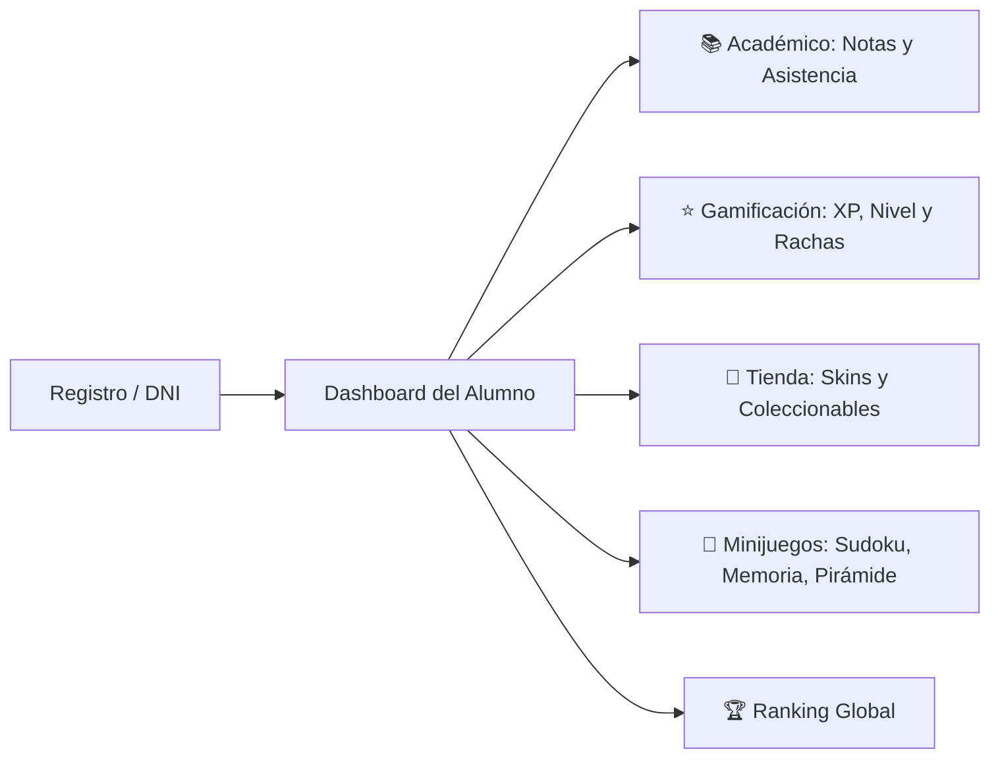

# 🎒 Manual del Estudiante — Notyx Edu

## 1. Visión General
El entorno del estudiante en **Notyx Edu** combina el seguimiento académico riguroso con mecánicas de videojuegos que premian el esfuerzo, la constancia y el progreso personal. Accesible tanto desde la **Web Responsive** como desde la **App Nativa para Android**.

---

## 2. Mapa de Experiencia del Alumno

---

## 3. Funcionalidades y Módulos

### A. Primer Ingreso y Vinculación
* **Ingreso con DNI (`/cargar-dni`):** El alumno ingresa su documento nacional para reclamar su cuenta pre-creada por el docente, sin configuraciones complejas.
* **Unirse a un Curso (`/j/:code`):** Ingresando el código de 6 caracteres provisto por el profesor, el estudiante queda enrolado automáticamente en la materia correspondiente.

### B. Dashboard Principal (`/home`)
* **Barra de Nivel y XP:** Muestra la experiencia acumulada y cuántos puntos faltan para alcanzar el siguiente nivel.
* **Contador de Rachas (Streaks):** Premia la asistencia y participación continua día a día.
* **Monedero Virtual:** Muestra las monedas obtenidas por buenas calificaciones, asistencias perfectas y desafíos completados.
* **Resumen de Asignaturas:** Calificaciones recientes, promedios y porcentaje de asistencia en cada materia.

### C. Sistema Pokémon y Coleccionables
* **Álbum de Cartas:** Cartas coleccionables con distintos niveles de rareza (Común, Rara, Épica, Legendaria).
* **Intercambio con Compañeros:** Posibilidad de comerciar e intercambiar cartas repetidas con otros estudiantes del curso.
* **Estadísticas y Poderes:** Cada carta cuenta con atributos vinculados a logros y desafíos superados.

### D. Tienda de Skins y Personalización (`/shop`)
* **Aspectos Visuales:** Utiliza las monedas ganadas en clase para adquirir skins de perfil, bordes luminosos y temas visuales exclusivos.
* **Efectos de Perfil:** Personaliza cómo te ven tus compañeros en el Ranking y en la Sesión en Vivo del aula.

### E. Arena de Minijuegos (`/games`)
Actividades diseñadas para agilizar la mente durante pausas activas o momentos libres:
1. **Sudoku:** Entrenamiento lógico con diferentes dificultades y recompensa de XP diaria.
2. **Juego de Memoria:** Reto visual para emparejar conceptos y cartas en el menor tiempo posible.
3. **Pirámide Matemática:** Resolución de problemas secuenciales bajo cronómetro.

### F. App Nativa Android (`android-app/`)
* Diseñada en **Kotlin + Jetpack Compose** para una navegación fluida, rápida y con bajo consumo de datos.
* Notificaciones inmediatas cuando el docente califica una tarea o inicia una sesión en vivo.
