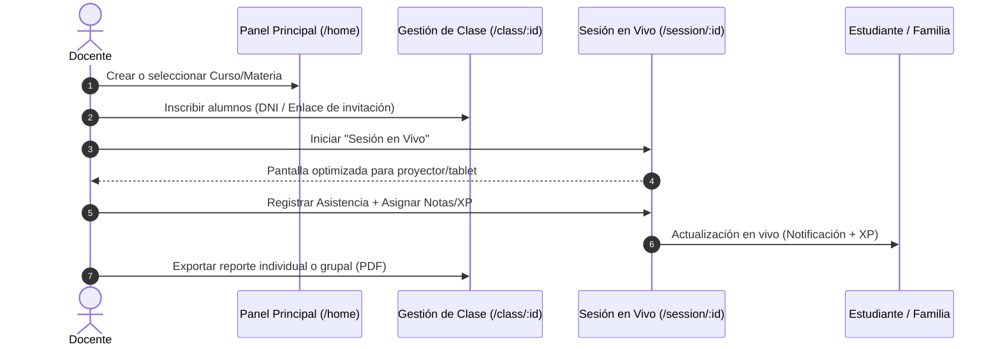

# 👨‍🏫 Manual del Docente — Notyx Edu

## 1. Visión General
El rol docente está optimizado para la **velocidad, precisión y cero fricción** en el aula de clases. Permite gestionar cursos, tomar asistencia en segundos, calificar participaciones en tiempo real frente a los alumnos (usando proyector o tablet) y generar reportes instantáneos para las familias sin carga administrativa adicional.

---

## 2. Flujo de Trabajo Principal

---

## 3. Funcionalidades Clave

### A. Gestión de Cursos y Estudiantes
* **Creación de Cursos:** Define nombre de la materia, año/división y criterios de evaluación.
* **Inscripción Rápida:**
  * **Por código de clase (`/j/:code`):** Los estudiantes ingresan el código para sumarse al curso.
  * **Carga por DNI (`/cargar-dni/:code`):** Permite pre-cargar la nómina con el número de documento para que cada alumno reclame su usuario fácilmente.
* **Gestión de Alumnos:** Edición de datos, enlace con tutores y visualización del estado académico individual.

### B. Sesión en Vivo (`/session/:id`)
Diseñada específicamente para proyectar en el aula o utilizar desde una tablet:
* **Toma de Asistencia con 1 Clic:** Estados *Presente*, *Ausente*, *Tarde* o *Justificado*.
* **Calificación Dinámica en Vivo:** Evalúa lecciones orales, participación en clase o tareas prácticas con entrega instantánea de feedback.
* **Entrega de Recompensas (Gamificación):** Asignación directa de puntos de experiencia (XP) y monedas virtuales para motivar la conducta positiva y el esfuerzo.

### C. Reportes y Analíticas Académicas
* **Modal de Reporte de Estudiante (`StudentReportModal`):**
  * Historial consolidado de notas y porcentaje de asistencia.
  * Gráfico de evolución temporal del desempeño.
  * Generación de reportes limpios y listos para imprimir o compartir en PDF.
* **Enlaces Públicos en Tiempo Real:** Comparte con un clic el enlace `/live/:token` para que los padres sigan el estado de sus hijos sin tener que registrarse.

---

## 4. Mejores Prácticas en el Aula
1. **Usa atajos de teclado y clics directos:** La interfaz está pensada para registrar notas en menos de 3 segundos por alumno.
2. **Proyecta la sesión en vivo:** Ver subir su barra de nivel y recibir insignias en pantalla genera un impacto motivador inmediato en el grupo.
3. **Envía el enlace público a los tutores a principio de año:** Reduce a cero los reclamos de "¿cómo va mi hijo?", ya que la información está siempre disponible y actualizada.
