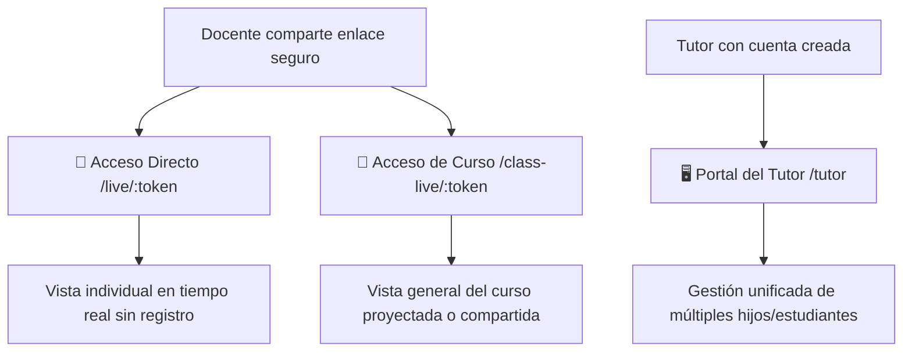

# 👨‍👩‍👧 Portal y Acceso de Padres/Tutores — Notyx Edu

## 1. Visión General
Notyx Edu elimina las barreras tradicionales de comunicación entre la escuela y el hogar. Los tutores pueden supervisar el rendimiento, asistencia y evolución de sus hijos **sin necesidad de descargar aplicaciones pesadas ni memorizar contraseñas complejas**, gracias a los enlaces dinámicos seguros.

---

## 2. Métodos de Acceso Familiar

---

## 3. Características Principales

### A. Vista Pública en Tiempo Real (`/live/:token`)
* **Acceso Inmediato:** El docente genera un token único por estudiante que la familia puede guardar en los marcadores de su celular.
* **Métricas Visibles:**
  * **Asistencia:** Porcentaje global, desglose de faltas y llegadas tarde.
  * **Calificaciones:** Notas de evaluaciones, trabajos prácticos y comentarios directos del docente.
  * **Progreso de Gamificación:** Nivel actual, XP y logros obtenidos (ayuda a la familia a reforzar positivamente el esfuerzo escolar).
* **Actualización en Vivo:** Al utilizar Supabase Realtime, cualquier nota o asistencia registrada por el profesor se refleja al instante en la pantalla del tutor.

### B. Portal Centralizado del Tutor (`/tutor`)
* Para aquellos padres o tutores que tienen más de un hijo en la institución o que prefieren una cuenta unificada.
* Permite alternar entre los perfiles de los estudiantes a cargo desde un único panel limpio y ordenado.

---

## 4. Privacidad y Seguridad
* Los enlaces `/live/:token` utilizan tokens criptográficos únicos e irrepetibles por alumno.
* No se exponen datos personales sensibles como direcciones, teléfonos ni DNI de terceros.
* El docente puede revocar o regenerar el token de un alumno en cualquier momento desde su panel de control si fuera necesario.
