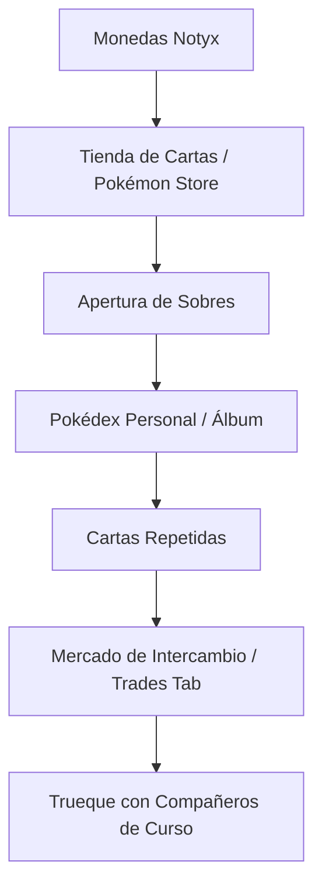

# 🎮 Guía de Gamificación, Cartas y Minijuegos — Notyx Edu

En **Notyx Edu**, la gamificación no es un simple adorno: es un motor pedagógico diseñado para motivar la asistencia, premiar el esfuerzo intelectual y fomentar la colaboración entre compañeros.

> [!TIP]
> Puedes ver la grabación interactiva en video de la tienda, ranking y vista del estudiante en el artefacto:
> 🎥 **[Video Demostración del Flujo del Estudiante y Gamificación](file:///C:/Users/TinChoX/.gemini/antigravity-ide/brain/c7d198b2-7644-4822-bca3-7e1d18f09003/student_tutorial_recording.md)**

---

## 💎 1. Economía y Progresión del Estudiante

### A. Experiencia (XP) y Niveles
* **¿Cómo se gana XP?**
  * Asistencia diaria puntual: **+10 a +25 XP**.
  * Aprobación de evaluaciones y tareas prácticas: **+50 a +150 XP**.
  * Participación destacada en clase: **+20 a +50 XP** otorgados por el profesor en vivo.
  * Superación de desafíos en minijuegos: **+10 a +30 XP** diarios.
* **Subida de Nivel:**
  * Al completar la barra de progreso, el estudiante sube de nivel con animaciones de celebración (confeti y desbloqueo de insignias).
  * Los niveles más altos desbloquean nuevos avatares, marcos para el perfil y títulos honoríficos.

### B. Monedas Notyx (Coins)
* Las monedas se obtienen mediante rachas de asistencia, logros académicos y excelencia en exámenes.
* Se utilizan para:
  1. Adquirir **sobres de cartas Pokémon** en la tienda.
  2. Comprar **skins y temas visuales** para personalizar la interfaz y el avatar.
  3. Desbloquear artículos exclusivos de temporada.

---

## 🎴 2. Sistema de Cartas Pokémon y Coleccionables

### Módulos del Sistema Pokémon:
* **Pokédex Personal (`PokedexTab`):** Visualiza todas las criaturas conseguidas, su nivel de rareza (Común, Rara, Épica, Legendaria) y estadísticas.
* **Detalle de Carta (`PokemonDetailsModal`):** Permite inspeccionar en 3D la ilustración, tipo elemental, puntos de combate y logros vinculados.
* **Tienda Pokémon (`PokemonStoreTab`):** Canjea monedas por sobres de expansión. La probabilidad de cartas raras se rige por un algoritmo transparente.
* **Sistema de Intercambio (`TradePokemonModal` y `TradesTab`):**
  * Los alumnos pueden crear solicitudes de intercambio con sus pares.
  * Permite intercambiar cartas repetidas por aquellas que aún faltan en la colección, incentivando el compañerismo y la negociación sana.

---

## 🧠 3. Arena de Minijuegos Mentales

Notyx Edu incluye cuatro minijuegos interactivos que estimulan el pensamiento lógico, el cálculo rápido y la memoria de trabajo:

| Minijuego | Habilidad que entrena | Dinámica |
|---|---|---|
| **Sudoku** (`SudokuGame`) | Pensamiento lógico y deducción | Tablero clásico adaptado por niveles de dificultad (Fácil, Medio, Difícil). |
| **Math Blitz** (`MathBlitzGame`) | Agilidad y cálculo mental rápido | Operaciones matemáticas contra reloj. Premia las rachas consecutivas sin fallos. |
| **Memoria** (`MemoryGame`) | Memoria visual y concentración | Encuentra parejas de cartas y conceptos en la menor cantidad de movimientos posibles. |
| **Pirámide** (`PyramidGame`) | Secuencias numéricas y deducción | Resuelve los pisos de la pirámide matemática encontrando las relaciones algebraicas. |

---

## 🛍️ 4. Tienda de Aspectos y Skins (`/shop`)

* **Personalización del Entorno:** Los estudiantes pueden adquirir temas cromáticos (Neón, Dark Cyberpunk, Glassmorphism pastel, etc.) para su interfaz web y móvil.
* **Reconocimiento Público:** Las skins y marcos adquiridos se proyectan en el aula durante la "Sesión en Vivo" del docente y en la tabla del **Ranking Global**, destacando el progreso del alumno ante su grupo.
