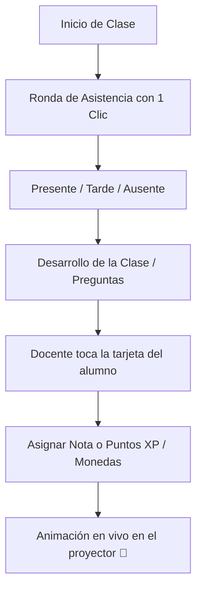

# 📘 Tutorial: Creando tu Primera Clase y Sesión en Vivo

Este tutorial paso a paso te guiará desde tu primer inicio de sesión como docente hasta la ejecución de tu primera clase interactiva con proyector en el aula.

---

## ⏱️ Duración Estimada
**5 a 10 minutos**

---

## 📋 Requisitos Previos
* Acceso a la plataforma web de Notyx Edu (navegador moderno como Chrome, Edge o Firefox).
* Nómina básica de estudiantes (nombres o números de DNI).

> [!TIP]
> Puedes ver la grabación en video del recorrido completo en el artefacto interactivo:
> 🎥 **[Video Demostración del Flujo Docente](file:///C:/Users/TinChoX/.gemini/antigravity-ide/brain/c7d198b2-7644-4822-bca3-7e1d18f09003/teacher_tutorial_recording.md)**

---

## Paso 1: Registro e Inicio de Sesión
1. Dirígete a la pantalla de bienvenida y haz clic en **Registrarse** (`/register`) o **Iniciar Sesión** (`/login`).
2. Ingresa tu correo electrónico y contraseña institucional o personal.
3. Al ingresar por primera vez, selecciona el rol **"Docente / Profesor"** en la pantalla de bienvenida.
4. Serás redirigido a tu panel principal (`/home`).

---

## Paso 2: Crear tu Primer Curso
1. En el panel de control, localiza la tarjeta con el botón **"+ Crear Nueva Clase"**.
2. Completa los datos requeridos:
   * **Nombre de la Materia:** Ej. *Matemática*, *Programación*, *Historia*.
   * **Año / División:** Ej. *4to A*, *2do 3ra*.
   * **Ciclo Lectivo:** Año actual.
3. Haz clic en **Guardar**. Tu nuevo curso aparecerá de inmediato en la lista de clases activas.

---

## Paso 3: Agregar a tus Estudiantes
Haz clic sobre la tarjeta de tu curso recién creado para acceder a la vista detallada (`/class/:id`). Tienes tres formas sencillas de enrolar a los alumnos:

* **Opción A (La más recomendada en el aula): Código de Clase**
  * Comparte en la pizarra el código alfanumérico generado (ej. `NX-4821`).
  * Los alumnos ingresan desde sus celulares a la URL `/j/NX-4821` y se incorporan al instante.
* **Opción B: Carga masiva por DNI**
  * Pega la lista de números de DNI de los alumnos. El sistema creará sus accesos predefinidos para que reclamen su usuario con su número de documento.
* **Opción C: Carga Manual**
  * Agrega Nombre, Apellido y datos de contacto de forma individual.

---

## Paso 4: Lanzar la "Sesión en Vivo" (`/session/:id`)
Cuando comience tu hora de clase:
1. Conecta tu computadora al **proyector del aula** (o abre la sesión desde una tablet).
2. Haz clic en el botón destacado **"Iniciar Sesión en Vivo"**.
3. La interfaz cambiará a un modo de alta legibilidad, diseñado para verse con claridad desde el fondo del salón.

---

## Paso 5: Dinámica en el Aula (Asistencia y Evaluación en Vivo)

1. **Tomar Asistencia:** Haz clic sobre el botón de estado de cada estudiante (*Presente* en verde, *Ausente* en rojo, *Tarde* en amarillo). En menos de un minuto tendrás la asistencia del día registrada en la nube.
2. **Recompensar Participación:** Cuando un alumno pase al pizarrón o responda una pregunta compleja, haz clic en su perfil y asígnale **+50 XP** o **+10 Monedas**.
3. **Efecto Inmediato:** El proyector mostrará la animación de nivel o recompensa, captando el entusiasmo y atención de todo el grupo.

---

## Paso 6: Exportar Reportes para Dirección o Familias
1. Al finalizar la clase o el bimestre, vuelve a la vista de curso (`/class/:id`).
2. Haz clic en cualquier estudiante y abre el **Reporte de Desempeño**.
3. Revisa la gráfica de evolución, las notas cronológicas y la asistencia acumulada.
4. Presiona **"Exportar PDF"** para obtener un documento limpio, profesional y listo para enviar o archivar.

🎉 **¡Felicitaciones!** Ya dominas el flujo completo de enseñanza y seguimiento con Notyx Edu.
