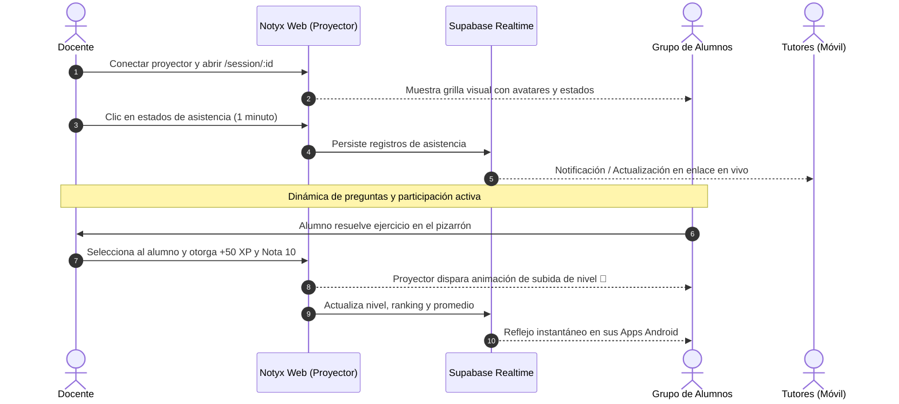

# ⚡ Caso de Uso: Dinámica de Clase en Vivo con Proyector

## 1. Ficha del Caso de Uso

* **Código:** `UC-01`
* **Nombre:** Gestión de Sesión en Vivo y Calificación con Proyector
* **Actores Principales:** Docente (Operador), Alumnos (Participantes y Receptores), Proyector/Pantalla del Aula.
* **Frecuencia:** Cada clase presencial (diario / semanal).
* **Objetivo:** Registrar asistencia y calificar participaciones en tiempo real con cero fricción, proyectando el avance grupal para fomentar la motivación y la transparencia.

---

## 2. Diagrama de Secuencia del Escenario

---

## 3. Escenario Paso a Paso

### A. Preparación (1 minuto antes de iniciar la clase)
1. El docente enciende el proyector del salón y abre su navegador en la computadora del aula.
2. Inicia sesión en Notyx Edu y accede al curso correspondiente.
3. Presiona el botón **"Iniciar Sesión en Vivo"** (`/session/:id`).
4. La pantalla muestra la cuadrícula con las tarjetas de todos los alumnos inscriptos, con sus avatares, niveles y skins personalizadas.

### B. Ronda de Asistencia Ágil (Minuto 0 a 2)
1. El docente nombra a los alumnos o realiza un conteo visual.
2. Por defecto todos los alumnos inician en estado neutral. Con un solo clic o toque en pantalla, el docente conmuta:
   * **Verde:** Presente
   * **Amarillo:** Tarde
   * **Rojo:** Ausente
   * **Azul:** Justificado
3. Al finalizar, la asistencia queda almacenada en la nube y calculada dentro del porcentaje general del ciclo lectivo.

### C. Evaluación y Gamificación en Tiempo Real
1. Durante la explicación o resolución de ejercicios, el profesor formula una pregunta o llama a un estudiante al pizarrón.
2. Tras la respuesta del alumno:
   * El docente toca la tarjeta del estudiante.
   * Se abre el menú rápido de acciones: permite ingresar una nota numérica directa (ej. 9/10) o bonificar con experiencia (**+50 XP** por participación destacada).
3. **Efecto en el aula:** La tarjeta del alumno en el proyector emite un destello visual, su barra de XP avanza y, si alcanza el umbral, se dispara la animación de *Level Up*.
4. Esto genera un ambiente de superación sana y entusiasmo colectivo.

---

## 4. Beneficios Comprobados
* **Ahorro de tiempo:** Elimina la doble carga en planillas de papel y pasaje manual a planillas de cálculo.
* **Transparencia total:** Los alumnos ven su calificación en el momento en que se genera, evitando confusiones o reclamos al final del período.
* **Tranquilidad para los tutores:** Los padres que consultan el enlace `/live/:token` ven la asistencia y la participación del día reflejada de inmediato.
